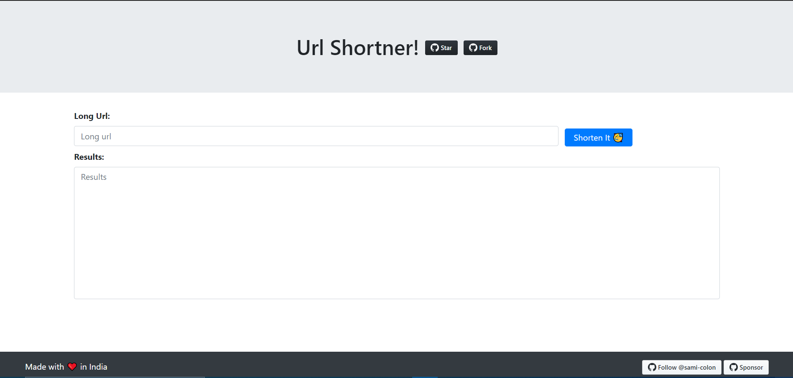

<!-- PROJECT LOGO -->
<br />
<p align="center">
  <a href="https://github.com/sami-colon/url_shortner">
    
  </a>

  <h3 align="center">Url Shortner</h3>

  <p align="center">
    Url shortner build using express js and mongoDb atlas. For shortening I have used nanoid to generate unique short urls for each long url.
    <br />
    <a href="https://github.com/sami-colon/url_shortner"><strong>Explore the docs »</strong></a>
    <br />
    <br />
    <a href="https://tinyurldemo.herokuapp.com/">View Demo</a>
    ·
    <a href="https://github.com/sami-colon/url_shortner/issues">Report Bug</a>
    ·
    <a href="https://github.com/sami-colon/url_shortner/issues">Request Feature</a>
  </p>
</p>


<!-- TABLE OF CONTENTS -->
<details open="open">
  <summary><h2 style="display: inline-block">Table of Contents</h2></summary>
  <ol>
    <li>
      <a href="#about-the-project">About The Project</a>
      <ul>
        <li><a href="#built-with">Built With</a></li>
      </ul>
    </li>
    <li>
      <a href="#getting-started">Getting Started</a>
      <ul>
        <li><a href="#prerequisites">Prerequisites</a></li>
        <li><a href="#installation">Installation</a></li>
      </ul>
    </li>
    <li><a href="#usage">Usage</a></li>
    <li><a href="#roadmap">Roadmap</a></li>
    <li><a href="#contributing">Contributing</a></li>
    <li><a href="#license">License</a></li>
    <li><a href="#contact">Contact</a></li>
    <li><a href="#acknowledgements">Acknowledgements</a></li>
  </ol>
</details>


<!-- ABOUT THE PROJECT -->
## About The Project
[Url Shortner](https://tinyurldemo.herokuapp.com/)
<p>
  Url shortner build using express js and mongoDb atlas. For shortening I have used nanoid to generate unique short urls for each long url.
</p>


### Built With

* [Node](https://nodejs.org/)
* [ExpresJs](https://expressjs.com/)
* [MongoDb Atlas](https://www.mongodb.com/cloud/atlas)


<!-- GETTING STARTED -->
## Getting Started

To get a local copy up and running follow these simple steps.

### Prerequisites

This is an example of how to list things you need to use the software and how to install them.
* npm
  ```sh
  npm install npm@latest -g
  ```

### Installation

1. Clone the repo
   ```sh
   git clone https://github.com/sami-colon/url_shortner.git
   ```
2. Install NPM packages
   ```sh
   npm install
   ```


<!-- USAGE EXAMPLES -->
## Usage

For the project to run, **these files must exist with exact filenames**:

* `src/index.js` is the JavaScript entry point.
* Run your mongoDb daemon server (or atlas cluster) and add its endpoint to `const MONGO_URI` in index.js

## Available Scripts

In the project directory, you can run:

### `npm start`

Runs the app in the development mode.<br>
Open [http://localhost:3000](http://localhost:3000) to view it in the browser.

The page will reload if you make edits.<br>
You will also see any lint errors in the console.


_For more examples, please refer to the [Documentation](https://example.com)_


<!-- CONTRIBUTING -->
## Contributing

Contributions are what make the open source community such an amazing place to be learn, inspire, and create. Any contributions you make are **greatly appreciated**.

1. Fork the Project
2. Create your Feature Branch (`git checkout -b feature/AmazingFeature`)
3. Commit your Changes (`git commit -m 'Add some AmazingFeature'`)
4. Push to the Branch (`git push origin feature/AmazingFeature`)
5. Open a Pull Request


<!-- LICENSE -->
## License

Distributed under the MIT License. See `LICENSE` for more information.


<!-- CONTACT -->
## Contact

Abhishek Kumar - [Email](mailto:abhishek@neweradevelopers.com)

Project Link: [https://github.com/sami-colon/url_shortner](https://github.com/sami-colon/url_shortner)


## sample images


<!-- MARKDOWN LINKS & IMAGES -->
<!-- https://www.markdownguide.org/basic-syntax/#reference-style-links -->
[contributors-shield]: https://img.shields.io/github/contributors/sami-colon/repo.svg?style=for-the-badge
[contributors-url]: https://github.com/sami-colon/url_shortner/graphs/contributors
[forks-shield]: https://img.shields.io/github/forks/sami-colon/repo.svg?style=for-the-badge
[forks-url]: https://github.com/sami-colon/url_shortner/network/members
[stars-shield]: https://img.shields.io/github/stars/sami-colon/repo.svg?style=for-the-badge
[stars-url]: https://github.com/sami-colon/url_shortner/stargazers
[issues-shield]: https://img.shields.io/github/issues/sami-colon/repo.svg?style=for-the-badge
[issues-url]: https://github.com/sami-colon/url_shortner/issues
[license-shield]: https://img.shields.io/github/license/sami-colon/repo.svg?style=for-the-badge
[license-url]: https://github.com/sami-colon/url_shortner/blob/master/LICENSE.txt
[linkedin-shield]: https://img.shields.io/badge/-LinkedIn-black.svg?style=for-the-badge&logo=linkedin&colorB=555
[linkedin-url]: https://linkedin.com/in/sami-colon
